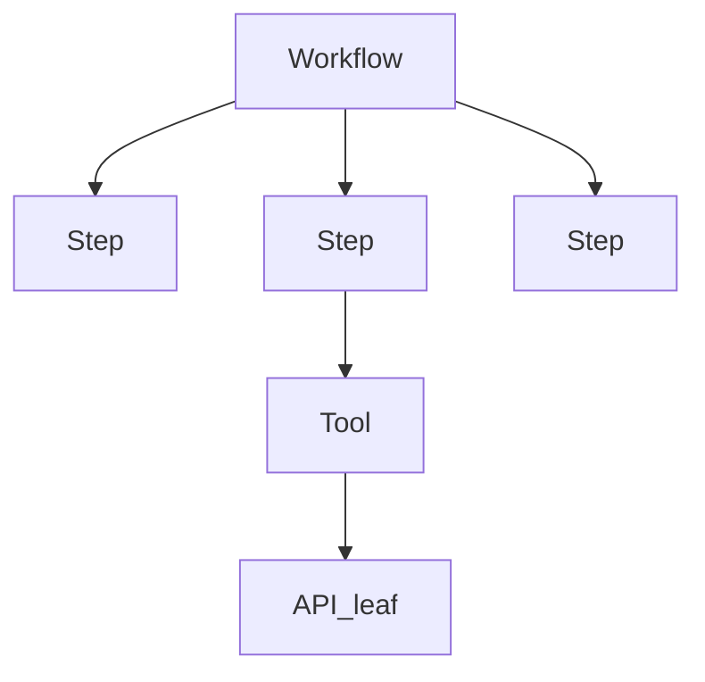

# Fluxera — Workflow + Tool Intelligence

Working spec for turning Fluxera from a mock API-leak dashboard into a real dual-product app: keep the leak lens, add Workflow + Tool Intelligence on one event stream, and phase toward dashboard-triggered recovery.

Deploy steps stay in [DEPLOY.md](DEPLOY.md). This file is what to build and where the files go.

The app must ultimately answer:

> What failed? → Why? → What did it affect? → How much did it cost? → How can we recover/prevent it?

That is the product, not another execution-log dashboard.

---

## Locked decisions

- **Keep both products.** The existing API-leak dashboard stays. Workflow + Tool Intelligence is added, not a replacement.
- **One event stream, two lenses.** Every tracked call is still a leaf (`status`, duration, error, cost) and still appears on the leak dashboard. If it carries workflow/step/tool context, it also appears in the tree. Standalone `track()` remains valid.
- **New SDK surface.** Primary: `fluxera.workflow` / `fluxera.step` / `fluxera.tool`. `track()` stays for leak-only API calls.
- **Nested wrappers + implicit context.** Same contract as today’s `track()` in [sdk/node/index.js](sdk/node/index.js): time it, classify the error, **rethrow**. Bind with AsyncLocalStorage (Node) / contextvars (Python). The customer does not pass `execution_id`.
- **Recovery north star = control plane, phased.** Schema and UI include recovery actions from day one. Phase 1 recommends + records local SDK retries. Phase 2: dashboard/API can trigger retry/fallback (customer webhook, or SDK poll). The backend never silently mutates the customer’s running request in Phase 1.
- **One `fx_` key per institute.** Institute = `customers` row. Public `POST /api/signup` `{ email, company }` mints that key. It is dashboard login and SDK auth. No second key, no rotate, no forgot-key email. Lost key + lost session → ops looks it up in the DB. Vendor secrets are never stored; tools appear when ingest upserts.

---

## What is broken today (facts, not decisions)

**Fixed (Phase 1):** intelligence schema in [db/intelligence.sql](db/intelligence.sql); ingest accepts tree fields and upserts workflows/tools; frontend split with [frontend/src/api.js](frontend/src/api.js) (`VITE_API_BASE`, default `http://127.0.0.1:3000`); leak-lens logs join `workflow_name` / `tool_name`; execution tree nests by `parent_step_id`; execution detail shows estimated users / revenue-at-risk only when customer impact config is set; integration coverage in [tests/run.js](tests/run.js).

**Still Phase 2+:** declared `depends_on` DAG, recovery execute, tool-detail five-question page.

---

## Product loop the app must answer



Every execution-detail and tool-detail screen answers, in order: **What failed? Why? What did it affect? How much did it cost? How do we recover/prevent it?** That is the product, not another log table.

---

## Recommended fills (not grilled — going with these)

- **Registration:** upsert on first sight of a workflow/tool name. No ceremony API for Phase 1. Optional PATCH later for recovery config and cost defaults.
- **Step dependencies:** Phase 1 = parent from wrapper nesting + sibling order from start time. Declared DAG (`depends_on`) in Phase 2 for cascading-failure analysis.
- **Partial:** an execution is `partial` if at least one step failed and at least one succeeded.
- **Cost:** price lives on the leaf (tool/API call). Roll up: step = sum of children, execution = sum of steps, retry/wasted = leaves with `attempt > 1` or status fail. Leak dashboard keeps `failed_api_cost = sum(price where fail)`.
- **Impact:** reuse existing `abandonment_rate` / `avg_order_value` on `customers`. “Users affected” only when those are set. “Workflows/executions affected” is always computable.
- **Root cause heuristic (no LLM for Phase 1):** failed step + most common `error_type` on its leaves + whether retries already fired + whether a child tool timed out. Enough to recommend retry vs fallback vs “this tool is down.”

---

## Target file structure (new features only)

Do not dump workflow/tool logic into [frontend/src/App.jsx](frontend/src/App.jsx), [backend/api/ingest.js](backend/api/ingest.js), or [sdk/node/index.js](sdk/node/index.js). Existing leak files stay. New product lives in new files, wired from [backend/server.js](backend/server.js) and a thin `App.jsx` shell.

Keep using the current `backend/api/*.js` route pattern (one Express router per resource). Do not add a second copy under the unused root `api/` folder.

```text
backend/
  api/
    ingest.js              # existing; accept extra tree fields, still write the leaf
    report.js              # existing leak lens — do not expand into workflow reports
    signup.js              # NEW  POST /api/signup — public mint, one fx_ key
    workflows.js           # NEW  GET /api/workflows, /:id
    executions.js          # NEW  GET /api/executions, /:id
    tools.js               # NEW  GET /api/tools, /:id
    recover.js             # NEW  POST /api/executions/:id/recover
  intelligence/
    upsert.js              # NEW  first-seen workflow/tool registry
    rollup.js              # NEW  cost/duration/status rollup onto steps + executions
    diagnose.js            # NEW  five-answer payload (failed step, why, impact, cost, recommend)
    status.js              # NEW  success | failed | partial
  processor/
    run.js                 # existing hourly leak processor
    intelligence.js        # NEW  optional hourly reliability aggregates (Phase 2)

db/
  schema.sql               # existing leak tables; ADD nullable FKs on request_logs only
  intelligence.sql         # NEW  workflows, tools, workflow_executions, execution_steps, recovery_actions
  seed.js                  # existing customer + flat logs
  seed-intelligence.js     # NEW  checkout tree: mixed success/partial/fail, nested tool/API leaves
  migrate.js               # apply schema.sql then intelligence.sql

sdk/node/
  index.js                 # existing client + track() + flush; attach new wrappers
  context.js               # NEW  AsyncLocalStorage (execution_id, step_id, tool_id, attempt)
  wrap.js                  # NEW  shared time/classify/rethrow/enqueue used by all wrappers
  workflow.js              # NEW  fluxera.workflow(name, fn)
  step.js                  # NEW  fluxera.step(name, fn)
  tool.js                  # NEW  fluxera.tool(name, fn, { price, retry })

frontend/src/
  App.jsx                  # shell + routing only; no mock-as-default
  api.js                   # NEW  API_BASE from Vite env, fetch helpers
  mock.js                  # MOVE demo generator out of App.jsx; explicit demo path only
  pages/
    Onboarding.jsx         # NEW  email + institute → key + SDK snippet + session
    Overview.jsx           # MOVE leak overview
    Logs.jsx               # MOVE leaf logs (+ workflow/tool filters)
    Settings.jsx           # MOVE
    Workflows.jsx          # NEW
    Tools.jsx              # NEW
    Executions.jsx         # NEW  list + History grouped-by-workflow view
    ExecutionDetail.jsx    # NEW  five-question screen (MVP)
  components/
    Nav.jsx                # MOVE
    ProductShell.jsx       # MOVE  add Workflows / Tools / Executions nav + History header button
    Tree.jsx               # NEW  step/tool tree on execution detail
    RecoveryCard.jsx       # NEW  recommend now; Recover button later

tests/
  run.js                   # existing
  intelligence.test.js     # NEW  status/partial, rollup, diagnose heuristic
```

Wire in [backend/server.js](backend/server.js):

```js
app.use('/api/signup',     require('./api/signup'))
app.use('/api/workflows',  require('./api/workflows'))
app.use('/api/executions', require('./api/executions'))
app.use('/api/tools',      require('./api/tools'))
```

Recover mounts on the executions router (`POST /api/executions/:id/recover`), not as a new top-level product.

Ingest still owns the write path: after inserting the leaf it calls `intelligence/upsert.js` + `intelligence/rollup.js`. Report stays leak-only.

---

## Data model (new tables, same leaf)

Keep `request_logs`. Add nullable FKs: `execution_id`, `step_id`, `tool_id`, `attempt`. That is how one stream feeds two lenses.

Add in [db/intelligence.sql](db/intelligence.sql):

- `workflows` — customer-scoped name, upserted
- `tools` — customer-scoped name, optional default price, optional `recovery_json` (retry policy, fallback tool name, webhook later)
- `workflow_executions` — `status` in `success | failed | partial`, start/end, duration, rolled-up cost
- `execution_steps` — name, parent_step_id, status, start/end, duration, rolled-up cost
- `recovery_actions` (rows even in Phase 1) — recommended vs executed, target step/tool, result, verified_at. Phase 1 writes `recommended` only unless the SDK did a local retry (those are `executed=sdk_local`)

Indexes: customer + time on executions; execution_id on steps and on `request_logs`.

[db/migrate.js](db/migrate.js) applies `schema.sql` then `intelligence.sql`.

---

## SDK (Node first, Python same shape)

```js
await fluxera.workflow('checkout', async () => {
  await fluxera.step('reserve', () => reserve())
  await fluxera.step('charge', async () => {
    await fluxera.tool('stripe', () => stripe.charge(), { price: 0.02, retry: 3 })
  })
})

// leak-only, no tree:
await fluxera.track(() => openai.call(), { endpoint: '/v1/chat', price: 0.04 })
```

Flush still batches to `POST /api/ingest`. Event payload grows: `kind` (`workflow_start | step_end | tool_call | api_call`), names, ids, attempt, parent ids. Server upserts registry + writes execution/step/leaf.

`track()` with no workflow context still writes a standalone leaf. That is the leak-only path.

---

## APIs

Existing leak routes stay:

- `POST /api/ingest` — accept extra tree fields; unknown extras must not drop the leaf
- `GET /api/report` — unchanged leak lens
- `POST /api/signup` — public `{ email, company }`; unique email; mints one `fx_` key; `201` `{ customer, sdk_config }`; `409` if the email already owns an institute. Rate-limited tighter than ingest. No email verification. Internal `POST /api/customers` (API_SECRET) stays for seed/ops.
- `GET /api/customers/me` — login check (Bearer key)

New:

- `GET /api/workflows`
- `GET /api/workflows/:id`
- `GET /api/executions?status=&workflow=` — list includes `failed_step`, `error_type`, `recovery_action` for the History checkup view
- `GET /api/executions/:id` — full tree + the five-answer payload from `intelligence/diagnose.js`
- `GET /api/tools`
- `GET /api/tools/:id`
- `POST /api/executions/:id/recover` — Phase 1 stores a recommended action (or 501 if not implemented as execute). Phase 2 invokes the customer webhook / next SDK poll

---

## Five-question contract

`GET /api/executions/:id` (and the matching tool-detail view) returns a diagnosis object, not just a log dump:

| Question | Source |
|---|---|
| What failed? | First failed step (or failed tool if the leaf is the failure) |
| Why? | Heuristic: most common `error_type` on that node’s leaves, retries already fired, child tool timeout |
| What did it affect? | This execution + workflow counts. Users/revenue only if `abandonment_rate` and `avg_order_value` are set |
| How much did it cost? | Failed leaf cost + retry/wasted (`attempt > 1`) rolled up to step and execution |
| How recover/prevent? | Recommend retry vs fallback vs “this tool is down”; persist on `recovery_actions` |

---

## UI

Fix first: `API_BASE` from Vite env in [frontend/src/api.js](frontend/src/api.js) (default `http://127.0.0.1:3000`). Demo mock lives in [frontend/src/mock.js](frontend/src/mock.js) as an explicit “View demo” path, not the default when a session has a key.

Auth on the landing:

- **Sign up** — [frontend/src/pages/Onboarding.jsx](frontend/src/pages/Onboarding.jsx): email + institute name → mint → show the key (copy) + SDK snippet → same step sets the dashboard session.
- **Sign in** — key only (`GET /api/customers/me`). No email on the form. Does not create a demo session.
- **View demo** — leak-lens mock, no key.
- **Settings** — live institute: copy the one key, no rotate, no switcher. Demo: paste an fx_ key to enter that institute. Lost key + lost session → ops looks it up.

Nav (keep leak, add intelligence):

- **Overview** — current leak numbers from real `/api/report` data
- **Workflows** — failure rate, cost, executions affected; per-row **History** opens that workflow’s checkups
- **Tools** — availability, failure rate, retry waste
- **Executions** — list + detail that is the five-question screen
- **History** — header button (not a sidebar item). Same `/api/executions` list grouped by workflow: when, status, failed step / error, last recovery rec, cost. Filter by one workflow from the Workflows row.
- **Logs** — existing leaf log, filterable by workflow/tool
- **Settings** — existing price + impact config; later recovery webhook URL

Execution detail ([frontend/src/pages/ExecutionDetail.jsx](frontend/src/pages/ExecutionDetail.jsx)) is the MVP screen: failed step highlighted, error types, duration bottleneck, rolled-up cost (failed vs retry waste), recommended recovery, later a Recover button.

---

## Seed + local run

- [db/seed.js](db/seed.js) keeps the existing customer + flat API logs (leak lens).
- [db/seed-intelligence.js](db/seed-intelligence.js) emits a real tree: one `checkout` workflow, mixed success/partial/fail, nested tool/API leaves, so local `/api/executions` is not empty.

```bash
node db/migrate.js
node db/seed.js
node db/seed-intelligence.js
node backend/server.js
# frontend: npm run dev in frontend/  →  http://127.0.0.1:5173

# Integration tests need the seeded key (printed by seed.js / seed-intelligence.js):
TEST_API_KEY=fx_test_… node tests/run.js
node tests/intelligence.test.js
# or: npm test  (server must be up for tests/run.js)
```

Sign in with the seeded `fx_` key against the local API, not Railway. Self-serve mint is Sign up (`POST /api/signup`). If they lose the key and the browser session, look the row up in `customers` — there is no in-app recovery.

---

## Phase 1 — workable app

Start with control-plane *schema and UI hooks*, without shipping the hot-path executor.

- Workflow + tool upsert, executions, steps, leaf FKs
- Success / failed / partial, duration, step tree
- Failed steps, error types, timeouts, local retries, failure rate, retry/wasted cost, cost rollups
- Impact: executions + workflows affected; business impact only if customer config exists
- Recovery: identify failed step, heuristic why, recommend retry/fallback; persist `recovery_actions` as recommended
- UI wired to local API, no mock as the real path
- Node SDK wrappers + ingest
- Files as listed in the tree above

### Workflow intelligence (Phase 1)

| Area | In |
|---|---|
| Execution | Registration (upsert), executions, start/end, success/failed/partial, duration, step-by-step, parent from nesting |
| Reliability | Failed steps, error types, timeouts, retries, failure rate |
| Cost | Cost per execution, per success, per fail, API/tool cost on the workflow, retry/wasted, total over time |
| Impact | Executions affected, workflows affected, operational cost; business/revenue impact when customer data exists |
| Recovery | Identify failed step, likely root cause, recommend retry/fallback |

### Tool intelligence (Phase 1)

| Area | In |
|---|---|
| Execution | Registration (upsert), tool calls, start/end, success/fail, duration |
| Reliability | Error types, timeouts, failure rate, retries |
| Cost | Cost per call, per success, per fail, retry cost, total over time |
| Impact | Workflows affected, executions affected, operational cost; business impact where measurable |
| Recovery | Detect failed tool, recommend retry/fallback |

Inputs/outputs metadata: store names, status, duration, error, cost, attempt. Do not store raw customer payloads in Phase 1.

---

## Phase 2 — reliability depth + execute recovery

Phase 1 answers the five questions from a single execution. Phase 2 makes that answer reliable over time, and turns “recommend” into “do it.”

**Landed.** Hourly snapshots in [backend/processor/intelligence.js](backend/processor/intelligence.js) and SDK poll (`GET /api/recover/pending`) stay later.

**Locked (grilled):**

- Scope = this section only. Not payloads, `user_id`, LLM, GitHub, Python SDK, or SDK poll.
- Recover **POSTs a customer webhook**. Backend never reaches into the in-flight request.
- Webhook URL on **customers** (Settings). Optional per-tool override in `tools.recovery_json.webhook_url`.
- Verify = **next execution of the same workflow with status `success`** sets `recovery_actions.verified_at`.
- `depends_on` is **optional step names** (`fluxera.step('charge', fn, { depends_on: ['reserve'] })`). Nested `parent_step_id` still implies cascade.
- Reliability is **live SQL** on GET (`?window=24h|7d`). Do not add a snapshot table. [backend/processor/intelligence.js](backend/processor/intelligence.js) stays a no-op this round.
- Tool **down** if 24h calls ≥ 5 and failure rate ≥ 50%.
- UI: no new nav. Badges on Workflows/Tools lists, cascade on the execution tree, **tool-detail five-question page**, Settings webhook field, Recover button that invokes the webhook.

### Reliability

- **Recurring failures:** fail+partial count in the window, `last_failed_at`, `still_failing` (a fail in the last hour). Surface on [backend/api/workflows.js](backend/api/workflows.js) and [backend/api/tools.js](backend/api/tools.js).
- **Bottlenecks:** p50/p95 duration (executions / step duration / tool `latency_ms`). Execution detail highlights this run’s slowest step.
- **Cascading failures:** step status `cascade` (CHECK: `success | fail | cascade`). Nested child of a failed/cascade parent → cascade. Sibling named in `depends_on` that is fail/cascade and this step fail → cascade. Own leaf fail with no broken dep → `fail`. Treat `cascade` as fail for execution `partial` math. Diagnose prefers the first own `fail` over `cascade`.
- **Tool availability:** `ok | down` from the threshold above. No separate uptime ping.
- **Dependency failures:** same cascade rule via `parent_step_id` + `depends_on` names. Store `depends_on TEXT[]` on `execution_steps` (not UUIDs — callers don’t have sibling ids).

### Recovery that executes

- `customers.webhook_url TEXT`. PATCH [backend/api/customers.js](backend/api/customers.js) (`http`/`https` only).
- `PATCH /api/tools/:id` for `recovery_json` (`retry`, fallback tool name, optional `webhook_url`).
- `POST /api/executions/:id/recover`: URL = tool override else customer URL else **400**. POST JSON `{ execution_id, workflow, action, step, tool, reason }`, ~5s timeout. Insert `kind=executed`, `result` = HTTP status or error. No HMAC.
- On ingest/rollup of a `success` execution: set `verified_at` on unmatched `kind=executed` rows for that `workflow_id` created before this execution.
- RecoveryCard: **Recover** (not “Record recommendation”). Show verified / still failing from `verified_at`.

SDK poll (`GET /api/recover/pending`) stays later.

### Impact + UI

- Tool detail: new page, same five-question contract as execution detail. Click through from the Tools list. `GET /api/tools/:id` adds diagnosis (latest failed execution that used the tool).
- List badges: recurring count, still failing, down.
- Tree: `cascade` vs `fail` (amber vs red). Identity / users-from-event stays Phase 3. Do not invent `user_id`.

### Files (additive)

- [db/intelligence.sql](db/intelligence.sql) — `webhook_url`, `depends_on TEXT[]`, status `cascade`, `request_logs(tool_id)` index
- [sdk/node/step.js](sdk/node/step.js) — pass `depends_on`
- [backend/intelligence/cascade.js](backend/intelligence/cascade.js) — tag cascade (pure, unit-tested)
- [backend/intelligence/rollup.js](backend/intelligence/rollup.js) — apply cascade + call verify
- [backend/api/ingest.js](backend/api/ingest.js) / [backend/intelligence/upsert.js](backend/intelligence/upsert.js) — persist `depends_on`
- [backend/api/workflows.js](backend/api/workflows.js), [backend/api/tools.js](backend/api/tools.js) — live window fields; PATCH tool
- [backend/api/recover.js](backend/api/recover.js) + [backend/api/executions.js](backend/api/executions.js) — execute webhook
- [frontend/src/pages/ToolDetail.jsx](frontend/src/pages/ToolDetail.jsx), Settings webhook, RecoveryCard, Tree, list badges
- Tests: cascade vs fail; down threshold; recover 400 without URL; executed against a tiny local listener; `verified_at` after a later success

### Build order

1. Schema + depends_on ingest + cascade rollup + seed
2. Live reliability on GET workflows/tools
3. Tool detail API + page
4. webhook_url Settings + Recover execute + verify
5. UI badges + tests + this section marked landed

Hourly snapshots in `intelligence.js` remain later.

---

## Early V1 — work + cost recovery

Control plane only. SDK reports checkpoints. Recover webhook tells the customer where to continue. Fluxera does not re-execute work.

**Landed.** Schema, ingest, diagnose, webhook, Settings threshold, RecoveryCard four-line cost, executions `interrupted`, workflow `cost_avoided`.

- Checkpoint hangs on the existing execution (`cursor`, `progress_done`, `progress_total`, `checkpoint_at` on the step). `fluxera.checkpoint({ done, total, cursor })` inside `step()`.
- `interrupted` is derived on read: no `ended_at` and last event older than `customers.interrupt_after_minutes` (default 15, Settings, 1–10080). Not stored.
- Webhook verbs: `resume` | `retry` | `fallback`. Payload includes `completed_steps` and `cursor`.
- Resume is a new execution with `recovery_of`. Cost avoided is measured on that child after it ends `success`. Latest child only.
- Leaf `cost_kind`: `api | tool | model | compute | third_party`. Default `tool` inside `tool()`, else `api`.
- `resume` verifies only when the linked child succeeds. Same-workflow later-success verify excludes `action = 'resume'`.

Later: business-value recovery, Python SDK, estimated recovery cost from the cursor percentage, stored `interrupted`, summing every failed resume.

---

## Early V1 — agent intelligence

**Landed.** An agent run is a workflow execution. Fluxera does not run the agent.

- `fluxera.agent(name, fn)` is `workflow()` with `actor=agent`. Inside it, reuse `step` / `tool` / `track` / `checkpoint`. Model calls stay leaves with `cost_kind=model`. No `fluxera.model()`.
- `workflows.actor` is `workflow | agent | memory` (default `workflow`). First sight wins, except a one-way upgrade `workflow → agent|memory`. Never demote, never switch agent ↔ memory.
- Agent state is the last checkpoint cursor. No conversation store.
- Cost, failures, interrupt, and recover stay the existing rollup, diagnose, and resume/retry/fallback webhook.
- Workflows and Executions filter with `?actor=`. Execution detail splits cost by `cost_kind` (`diagnosis.cost.by_kind`). No new nav.

---

## Phase 3 — product completeness

After recovery actually runs and reliability is computed, not before.

- **Python SDK** — same `workflow` / `step` / `tool` / `track` surface as Node (`contextvars`).
- **Identity on events** — optional `user_id` on ingest leaves so “users affected” is real.
- **Tool input/output metadata** — sizes, content-types, redacted keys. Still no raw payloads unless a customer opts in.
- **Self-serve signup** — landed. Public `POST /api/signup` mints one `fx_` key (login + SDK). Internal `POST /api/customers` stays for seed/ops. No rotate / no forgot-key.
- **Live-ish feed** — short poll or SSE of new executions. Not a streaming product.
- **LLM root-cause** — optional, behind a flag, never a substitute for the heuristic. The five questions must still resolve without it.
- **Alerts** — recurring-failure threshold emails using `alerts_sent`.
- **Maestro** — keep [tests/maestro/](tests/maestro/) green; add an authenticated flow once a test key can be injected without putting secrets in YAML.

### SCM integrations (GitHub / GitLab)

One customer, one `fx_` key — linked repos are metadata under that customer, not a new workspace per API or per repo.

| Phase | Scope |
|---|---|
| **A — manual** | Document wrapping GitHub/GitLab REST/GraphQL calls as `tool()` / `track()` (same event stream as today). |
| **B — connect** | Settings: OAuth or PAT for GitHub + GitLab; store integration per customer (encrypted); optional repo allowlist. |
| **C — context** | Optional ingest / execution fields (`repo`, `commit_sha`, `pr_number`, `ci_job_id`) on the dashboard — does not replace leaf `price` + `error_type` for leak math. |
| **D — CI** | Optional webhook or CI template so Actions / GitLab CI emit workflow/step events without prod app code. |

Out of scope for SCM: full code scanning, billing GitHub/GitLab as separate products.

Out of scope until someone is paying for it: a second ingest pipeline, rewriting `/api/report` as a workflow report, storing raw tool bodies by default.

---

## Maestro UI tests

Web flows against the local dashboard (Chromium). App must be running (`frontend` + `backend`).

```bash
maestro test tests/maestro/ --headless
# dashboard must be the URL in the flow headers (currently http://127.0.0.1:5174)
```

| Flow | What it covers |
|---|---|
| [tests/maestro/landing.yaml](tests/maestro/landing.yaml) | Marketing landing, How it works |
| [tests/maestro/demo-dashboard.yaml](tests/maestro/demo-dashboard.yaml) | View demo, Overview, Workflows/Tools/Executions empty-states, Logs, Settings, sign out |

`url:` in the YAML headers must match the Vite port. Change `http://127.0.0.1:5174` if the dashboard is on 5173.

Authenticated (seeded `fx_` key) coverage stays in curl / [tests/run.js](tests/run.js) until Phase 3 adds a Maestro login flow that takes the key from env, not the repo.

Maestro Web is beta. If `assertVisible` hangs after `openLink` completes, Chromium is not exposing the page tree — check [Maestro Viewer](http://127.0.0.1:10000/) and that Vite is actually serving the URL in the flow.

---

## Known issues (browser QA, 2026-09-27)

Found clicking through the live dashboard at `http://127.0.0.1:5174/` (demo + seeded `fx_` session). Not Phase 0 gaps.

| Issue | Where | Status |
|---|---|---|
| **View demo / Find your number skip Sign in.** `enterDashboard()` created a demo session whenever Overview opened with no session, so marketing CTAs never hit the key form. | [frontend/src/App.jsx](frontend/src/App.jsx); [frontend/src/components/Nav.jsx](frontend/src/components/Nav.jsx) | **Fixed.** Sign in is `go("overview")` (key-only form). View demo stays `enterDashboard`. Sign up goes to onboarding without a demo session. |
| **Workflows / Tools / Executions flashed “none yet” before the fetch returned.** Empty array was the initial state, so the empty copy rendered for a beat. | [frontend/src/pages/Workflows.jsx](frontend/src/pages/Workflows.jsx), Tools, Executions | **Fixed.** Those pages show `Loading...` until the request finishes. |
| **Stale live numbers after Sign out → View demo.** One paint kept the previous tenant’s `/api/report` totals under STATIC, then swapped to mock. `onLogout` cleared session but not `data`. | [frontend/src/App.jsx](frontend/src/App.jsx) | **Fixed.** Logout also `setData(null)`. |

Do not put seeded API keys in Maestro YAML or in this file.

---

Phase 1 is done. Remaining work is Phase 2 then Phase 3 above. Do not pull Phase 3 items into Phase 2. History (grouped checkups) shipped on top of Phase 1 without a new route file — it reuses [frontend/src/pages/Executions.jsx](frontend/src/pages/Executions.jsx).
